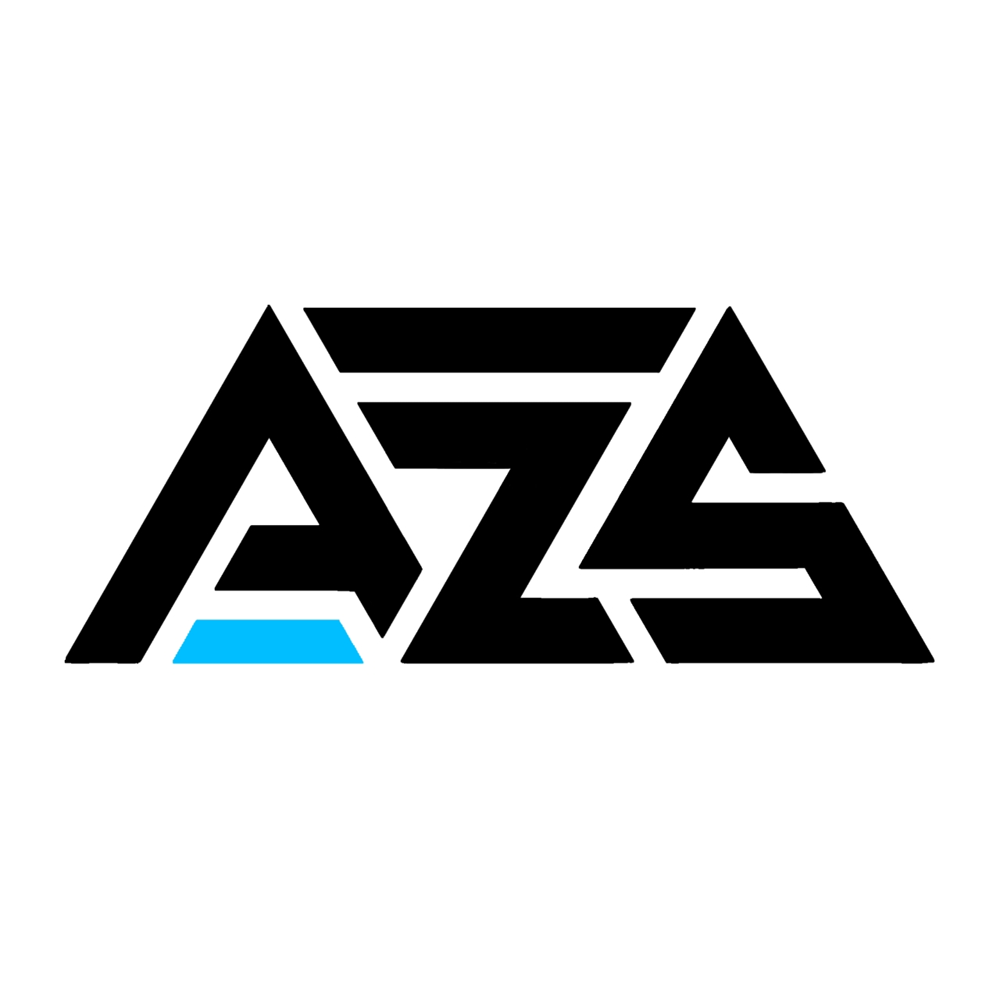

# 🎮 Azeriqo Store Manager

**Azeriqo Store Manager** adalah aplikasi manajemen inventaris berbasis web yang dirancang khusus untuk mengelola stok akun game (seperti Mobile Legends, PUBG, dll) secara efisien, aman, dan terukur. 

Aplikasi ini dibangun menggunakan **Laravel** dan dioptimalkan untuk berjalan di lingkungan Serverless (**Vercel**) dengan database Cloud (**TiDB**).

 ## ✨ Fitur Utama

### 1. Manajemen Stok & Akun
* **Generator Otomatis:** Membuat ribuan username dan password acak dengan pola kustom (Prefix/Suffix) dalam hitungan detik.
* **CRUD Database:** Tambah, Edit, Hapus, dan Lihat detail akun dengan mudah.
* **Copy-to-Clipboard:** Salin username/password dengan satu klik.
* **Kategori Dinamis:** Kelompokkan akun berdasarkan jenis game atau level.

### 2. Multi-Role User (ACL)
* **Admin:** Memiliki akses penuh (Manage Workers, Settings, Hapus Data, Import/Export).
* **Worker:** Hanya bisa Input data dan Melihat stok. Tidak bisa menghapus data atau mengubah pengaturan toko.

### 3. Produktivitas & Keamanan
* **Bulk Import & Export:** Upload ribuan akun via file `.txt` atau download stok untuk backup/dikirim ke pembeli.
* **Log Aktivitas:** Pantau kinerja worker (siapa input apa, jam berapa).
* **Notifikasi Telegram:** Notifikasi *real-time* ke grup admin setiap kali ada input stok baru.

### 4. UI/UX Modern
* **100% Mobile Responsive:** Tampilan optimal di HP (Tabel bisa di-scroll, menu sidebar responsif).
* **Dark Mode 🌙:** Mode gelap otomatis/manual yang nyaman di mata.
* **Interaktif:** Loading bar (NProgress) dan animasi background (Particles.js).

---

## 🛠️ Teknologi yang Digunakan

* **Framework:** Laravel 11
* **Database:** TiDB Cloud (MySQL Compatible)
* **Frontend:** Blade Templating, Vanilla CSS (Variables), JavaScript
* **Hosting:** Vercel (Serverless Function)
* **API Integrations:** Telegram Bot API

---

## 🚀 Instalasi Lokal (Di Laptop)

Ikuti langkah ini untuk menjalankan aplikasi di komputer Anda:

1.  **Clone Repository**
    ```bash
    git clone [https://github.com/RhmdnnD/Azeriqo-Store-Manager.git](https://github.com/RhmdnnD/Azeriqo-Store-Manager.git)
    cd azeriqo-store-manager
    ```

2.  **Install Dependencies**
    ```bash
    composer install
    npm install && npm run build
    ```

3.  **Setup Environment**
    * Duplikat file `.env.example` menjadi `.env`.
    * Atur koneksi database (MySQL/TiDB).
    ```env
    DB_CONNECTION=mysql
    DB_HOST=127.0.0.1
    DB_PORT=3306
    DB_DATABASE=nama_database
    DB_USERNAME=root
    DB_PASSWORD=
    ```

4.  **Generate Key & Migrasi**
    ```bash
    php artisan key:generate
    php artisan migrate --seed
    ```
    *(Seed akan membuat akun admin default)*

5.  **Jalankan Server**
    ```bash
    php artisan serve
    ```
    Buka `http://127.0.0.1:8000` di browser.

---

## ☁️ Deployment ke Vercel (Production)

Aplikasi ini sudah dikonfigurasi khusus untuk berjalan di Vercel dengan `vercel.json` dan penyesuaian SSL TiDB.

### 1. Konfigurasi Environment (Vercel Dashboard)
Pastikan Anda memasukkan Variable berikut di **Settings > Environment Variables**:

| Key | Value | Deskripsi |
| :--- | :--- | :--- |
| `APP_KEY` | (Dari .env lokal) | Kunci enkripsi Laravel |
| `APP_DEBUG` | `false` | Matikan debug saat live |
| `APP_URL` | `https://nama-project.vercel.app` | URL Vercel Anda |
| `DB_CONNECTION` | `mysql` | Driver Database |
| `DB_HOST` | (Host TiDB Cloud) | Host Database |
| `DB_PORT` | `4000` | Port TiDB |
| `DB_DATABASE` | `test` (atau nama DB Anda) | Nama Database |
| `DB_USERNAME` | (User TiDB) | User Database |
| `DB_PASSWORD` | (Pass TiDB) | Password Database |
| `MYSQL_ATTR_SSL_CA` | `/etc/ssl/certs/ca-certificates.crt` | Wajib untuk TiDB di Vercel |
| `SESSION_DRIVER` | `cookie` | Agar login tidak mental di Serverless |
| `TELEGRAM_BOT_TOKEN` | (Token dari @BotFather) | Untuk notifikasi |
| `TELEGRAM_CHAT_ID` | (ID Grup -100xxx) | Tujuan notifikasi |

### 2. Catatan Khusus
* **Migrasi Database:** Karena Vercel tidak memiliki SSH terminal, migrasi database dilakukan melalui route khusus (jika disediakan) atau menggunakan koneksi remote dari laptop via `php artisan migrate`.
* **SSL Mode:** Config database telah disesuaikan di `config/database.php` untuk mendukung SSL Mode yang diwajibkan TiDB.

---

## 🔐 Akun Default (Seeder)

Jika Anda menjalankan `php artisan migrate --seed`, akun admin default adalah:

* **Email:** `admin@azeriqo.com`
* **Password:** `password123`

*(Segera ganti password setelah login!)*

---

## 📜 Lisensi

Aplikasi ini bersifat Private/Proprietary untuk **Azeriqo Store**.
Dibuat dengan ❤️ menggunakan Laravel.